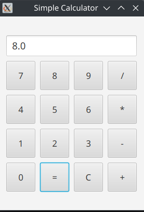

= SimpleCalculator
Autor: Dein Name
Version: 1.0
== Themenschwerpunkte
* JavaFX
* GUI-Design
* Mathe

== Aufgabenstellung
* Erstellen Sie eine JavaFX-Anwendung, die als einfacher Taschenrechner fungiert.
* Der Taschenrechner soll die Grundrechenarten (Addition, Subtraktion, Multiplikation und Division) unterstützen.
* Die Eingabe und Ausgabe erfolgt über eine grafische Benutzeroberfläche (GUI), die mit JavaFX erstellt wird.

== Features
* Addition, Subtraktion, Multiplikation und Division
* Benutzerfreundliche grafische Oberfläche (GUI) mit JavaFX
* Einfache Eingabe und Ausgabe von Zahlen und Ergebnissen
* Fehlerbehandlung bei ungültigen Eingaben (z.B. Division durch Null)

== Screenshots

== Beispiel
Hier ist ein Beispiel, wie der Taschenrechner funktioniert:

``
5 + 3 = 8
``

== Fehlerbehandlung
* **Division durch Null:** Falls der Benutzer versucht, durch Null zu dividieren, zeigt die Anwendung eine Fehlermeldung an.
* **Ungültige Eingabe:** Wenn der Benutzer eine ungültige Zahl eingibt, wird eine entsprechende Warnung angezeigt.

----
____   ____.__       .__      _________                          ._.
\   \ /   /|__| ____ |  |    /   _____/__________    ______ _____| |
 \   Y   / |  |/ __ \|  |    \_____  \\____ \__  \  /  ___//  ___/ |
  \     /  |  \  ___/|  |__  /        \  |_> > __ \_\___ \ \___ \ \|
   \___/   |__|\___  >____/ /_______  /   __(____  /____  >____  >__
                   \/               \/|__|       \/     \/     \/ \/
----